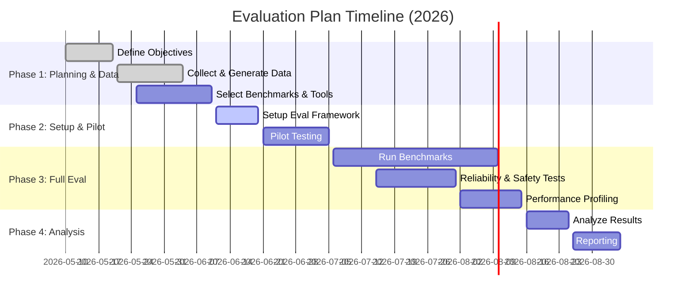

# Executive Summary  
Evaluating an autonomous personal‐finance AI agent requires a holistic, multi‐dimensional approach. Rather than relying on single-turn accuracy, **agentic evaluation frameworks** assess the full system behavior over multi-step tasks, considering safety, robustness, alignment, and real‐world constraints【7†L260-L268】【10†L116-L125】. Recent frameworks (e.g. *CLEAR*: Cost, Latency, Efficacy, Assurance, Reliability【3†L231-L239】) emphasize cost-efficiency and reliability alongside task success. Similarly, evaluation taxonomies highlight **Agent Behavior** (task success, output quality), **Capabilities** (planning, tool use, memory), **Reliability**, and **Safety/Alignment** as core dimensions【10†L116-L125】. 

Effective evaluation combines **automated benchmarks** (simulations, datasets, leaderboards) with **human-in-the-loop** and operational tests【7†L268-L276】【12†L633-L642】. We identify relevant benchmarks: general agent benchmarks (e.g. ALFWorld, BabyAI/MiniGrid, Procgen, HumanEval, MT-Bench, AGIEval), and finance‐specific benchmarks (e.g. the “Finance Agent Benchmark” with 537 SEC‐related questions【15†L25-L33】, credit/fraud datasets, budgeting/forecasting tasks). Evaluation **tools** include OpenAI Evals, LangChain Evals, MLflow, TruLens, RAGAS/LANGAdapters, and platforms like EvalAI, Azure AI Foundry, etc【7†L332-L342】【12†L674-L682】. Metrics span **task success/reward**, economic measures (ROI, risk-adjusted returns), **safety** (violations, PII leaks), **fairness**, privacy leakage (e.g. membership inference risk), **latency**, **energy/memory** usage on target hardware, model size, and sample-efficiency. Regulatory and privacy criteria (GDPR, PCI-DSS, explainability rules) must also guide evaluation, suggesting techniques like differential privacy and federated eval for data protection. 

We map each candidate framework/benchmark/tool to the personal-finance edge agent, noting pros/cons, data needs, and effort. For example, CLEAR’s multi-dimensional scoring (including a **Policy Adherence Score** for compliance【3†L231-L239】) is directly relevant to financial regulations, but requires cost annotations and multiple runs. The Finance Agent Benchmark offers realistic tasks and rubrics【15†L28-L37】, yet focuses on stock/SEC analysis rather than day-to-day personal finance tasks; it provides agent tooling (Google, EDGAR) similar to what our agent might need. Edge profiling tools (e.g. EdgeProfiler【49†L39-L47】) can measure on-device latency and energy for quantized models. We recommend an evaluation suite combining (a) automated simulations of financial tasks (e.g. transaction summaries, budgeting, forecasting), (b) standard AI-agent benchmarks (e.g. agentic planning in MiniWoB/WebArena for multi-step reasoning【12†L618-L625】), (c) privacy tests (synthetic PII leakage), and (d) hardware profiling. 

Finally, we propose a phased implementation plan (data gathering, tool integration, benchmarking, analysis) with timelines. Key deliverables include: curated finance datasets (real or synthetic), an evaluation harness using LangChain/OpenAI Evals, metrics dashboards (latency, cost, success, safety incidents), and compliance checklists. Tables below summarize top frameworks, benchmarks, and tools across **applicability**, **metrics**, **data needs**, **edge feasibility**, and **effort**. We also suggest synthetic data generators (GAN/VAE-based, e.g. **Tonic** or JPMorgan’s synthetic financial datasets【26†L21-L23】) to create realistic transaction records. 

## 1. Agentic Evaluation Frameworks  
**Key idea:** Treat the agent as a system executing multi-step workflows, not just an LLM answering a prompt【7†L260-L268】【10†L116-L125】. Evaluate across multiple dimensions:

- **Task/Goal-Oriented Efficacy:** Measure *task completion rate*, output correctness, and quality. Use domain-specific success metrics (e.g. correctly categorized transactions, accuracy of forecasts). Standard benchmarks like HumanEval and MT-Bench (for coding/chat) test single tasks; for agents use multi-step benchmarks (WebArena【12†L618-L625】, AssistantBench).  
- **Safety & Compliance:** Incorporate *policy adherence* and *safety* metrics. For finance, this includes adherence to privacy rules (GDPR), no unauthorized actions (PCI-DSS for payment data), and *explainability* requirements. CLEAR defines a **Policy Adherence Score (PAS)** to count forbidden actions【3†L231-L239】. Datasets like *CoSafe* (Yuan et al.) test response to adversarial queries. Tools like *InspectAI* and *DeepEval* can simulate malicious prompts or PII leaks.  
- **Robustness & Reliability:** Test consistency under perturbations and over repeated runs. Use **pass@k** (k-run consistency) to assess reliability【3†L241-L249】. For example, CLEAR found GPT-4 agents dropped from ~72% success (pass@1) to ~58% (pass@8)【3†L303-L312】. Also test recovery from tool or network failures (stress tests).  
- **Alignment & Trust:** Evaluate alignment with user intent and ethical norms. Hybrid evaluation is critical: automated (e.g. LLM-as-judge scoring【12†L646-L655】) plus human reviews of tone, appropriateness【7†L268-L276】. Incorporate *adversarial/safety* datasets (e.g. AgentHarm for biased/harmful content【12†L622-L625】).  
- **Interpretability:** Not widely standardized for agents yet. Could include traceability of decisions (logging tool calls), rationales. Tools like *TruLens* or specialized LLM explainers can monitor internal states.  
- **Autonomy & Planning:** Metrics for how well the agent plans multi-step goals (length of plan, number of steps, success of each). Benchmarks like BabyAI or LLMBabyBench test grounded planning. Use state-space coverage or planning depth.  
- **Long-Horizon Performance:** Assess performance on tasks that span long interactions or days (e.g. continuous budgeting). Simulate long sessions or recurrent schedules.  
- **Efficiency (CLEAR dimensions):**  
  - *Cost:* Cost-per-task (API calls, compute), normalized success cost【3†L197-L205】.  
  - *Latency:* End-to-end response time and SLA compliance (e.g. “answer within 2s for user queries”)【3†L213-L221】.  
  - *Resource Utilization:* Model size, memory footprint. On edge, measure CPU/GPU usage and energy per inference (see EdgeProfiler【49†L39-L47】).  
  - *Sample Efficiency:* Data needed to train/fine-tune. Low-sample benchmarks or synthetic data generation techniques.  
- **Multi-Agent/Collaboration:** If relevant (e.g. agent interacts with humans or other systems), measure coordination success (not central here).  

**Representative Frameworks:**  
- **CLEAR (Cost, Latency, Efficacy, Assurance, Reliability)** – a holistic framework for enterprise agents【3†L197-L205】【3†L241-L249】. CLEAR introduces cost‐normalized accuracy and SLA compliance, plus policy adherence and pass@k reliability. Its *multi‐dimensional rubric* can be tailored (e.g. heavier weight on Compliance for finance)【3†L253-L262】.  
- **Mohammadi et al. Survey Taxonomy** – categorizes evaluation into *Agent Behavior, Capabilities, Reliability, Safety/Alignment* (the “what”) and process modes *static vs interactive, benchmarks, metrics, tooling* (the “how”)【10†L116-L125】. Use this to ensure coverage of all aspects.  
- **InfoQ/Practitioner Guidelines** – Emphasize that *“behavior beats benchmarks”:* focus on real-world task success, recovery, consistency【7†L268-L276】. Use hybrid eval pipelines combining automated LLM-as-judge scoring and human review【7†L268-L276】【12†L646-L655】. Incorporate operational constraints (latency, cost, tool reliability, policy compliance) as first-class metrics【7†L277-L284】.  

## 2. Benchmarks & Datasets  

### 2.1 General Agentic Benchmarks  
- **ALFWorld** – A simulated environment combining *TextWorld* and *ALFRED* visual tasks【40†L54-L63】. Tests embodied reasoning (e.g. fetch “washed apple in fridge”). Agents must plan abstractly then execute. (Use to test reasoning-generalization, although not finance-specific.)  
- **BabyAI / MiniGrid** – Grid-world language-based tasks (navigation, instruction following). Good for multi-step planning. (LLM-BabyBench adapts this for LLMs).  
- **Procgen Benchmark** (OpenAI) – 2D game-like RL tasks to test generalization. Emphasizes sample efficiency.  
- **MiniWoB & WebArena** – Browser-based tasks; agents fill forms, click buttons. Evaluates reasoning and tool use with interactive web UI. (WebArena cited in CLEAR’s analysis【3†L231-L239】).  
- **MT-Bench** – Multi-turn dialogue tasks for ChatGPT-like evaluation. (Focuses on conversation quality, but limited to open-domain reasoning.)  
- **AGIEval / LLMAgent-Evals** – Leaderboards of general ability tests across subjects (typically static Q&A, not multi-step). Limited for agentic behavior.  
- **AssistantBench, AppWorld** – Simulated task sets: AssistantBench has 214 web tasks (time-consuming, navigation)【12†L618-L625】; AppWorld tests app control. Good for multi-step workflows.  
- **Function-Calling Benchmarks** – (ToolBench【38†L251-L261】, ComplexFuncBench, API-Bank) test ability to use APIs and call functions. Personal finance agent might use financial APIs (e.g. currency conversion, stock quotes). These benchmarks provide hundreds/thousands of structured API calls【38†L291-L300】.  
- **Code and QA Benchmarks** – *HumanEval* (code completion), *MATH/FinQA* (math/finance Q&A). FinQA (Wang et al) focuses on financial reasoning about statements (not agentic planning, but relevant domain knowledge).  
- **Adversarial/Safety Datasets** – e.g. *CoSafe* tests refusal on illicit instructions. *AgentHarm* for biased/harmful content, *AgentDojo* for injection attacks【12†L622-L625】.  
- **Leaderboards:** Berkerley Function-Calling Leaderboard (BFCL) and Holistic Agent Leaderboard aggregate scores on tool-use and multi-env tasks【12†L624-L629】.  

### 2.2 Finance-Specific Benchmarks and Data  
- **Finance Agent Benchmark (Vals AI, 2025)** – 537 expert-crafted finance questions (SEC filings analysis, modeling) with step-by-step answers【15†L25-L34】【15†L88-L97】. Includes an “agentic harness” (LLM + Google Search + EDGAR) and rubric-based LLM-as-judge grading【15†L88-L97】. Revealed even top models (Claude 3.7, etc.) only ~47% accuracy at moderate cost【15†L33-L39】. *Use*: Validate reasoning on realistic financial analysis tasks (though oriented to investment research, not everyday personal finance).  
- **Kaggle Personal Finance Datasets:** Several public datasets of synthetic/account transactions: e.g. **Personal Finance Tracker** (~3,000 users’ multi-year transactions), **BudgetWise Personal Finance** (expense forecasting), **USA Banking Transactions 2023-24**, **Credit Card Fraud** (Pennies = anomaly detection), **German Credit** (credit risk). These offer transaction-level data for tasks like budgeting (category prediction), anomaly detection (fraud), spending analysis. (While exact Kaggle pages aren’t citable, they demonstrate availability of finance data.)  
- **Forecasting Datasets:** M, M3, and other time-series competitions (macroeconomic/financial series) to evaluate forecasting models. For personal finance, synthetic salary/expenditure time series can be used.  
- **Fraud/AML Datasets:** *Credit Card Fraud (Kaggle)* – 284K Europan card txns (PCA features). *PaySim* – mobile money transaction simulator for fraud. *AML synthetic* (NeurIPS ‘23) provides generator and datasets【27†L29-L37】. Evaluate agent’s ability to flag anomalies or comply with anti-fraud rules.  
- **Credit Scoring:** UCI “German Credit” and “Give Me Some Credit” (Kaggle) for default prediction. Test fairness and risk analysis.  
- **Budgeting Datasets:** Synthetic household budgets (e.g. Tonic.ai’s demos, GoMask.ai Budgeting Records【26†L10-L14】). Useful for agents recommending budgets or forecasting cashflow.  
- **Investment/Portfolio:** Historical stock market data (S&P500, Crypto), Kaggle portfolio optimization datasets【48†】. Test agent’s analysis/optimization decisions (but high risk domain).  
- **Synthetic Data Generators:** For privacy and availability, use tools like CTGAN/SDV, or platforms (Gretel.ai, Tonic.ai) to **generate realistic synthetic transactions** with similar statistics (sums, category patterns). JPMorgan’s synthetic dataset research【26†L5-L13】 and open-source (Altman et al., 2023) offer guidance. Synthetic data helps simulate large user base without leaks.  

### 2.3 Benchmarks Leaderboards  
- **OpenAI Evals** – Not a fixed dataset but a framework with example evals (some finance categories exist).  
- **Finance Agent Benchmark Leaderboard** – Ranks LLMs on the above 537 tasks (Claude leads at ~47%)【15†L33-L39】.  
- **Kaggle Competitions** – E.g. credit risk/fraud detection leaderboards.  
- **Academic/Industry Leaderboards:** None mainstream for personal-finance agents specifically, but emerging work (Milo AI’s Finance Agent).

## 3. Evaluation Tools & Systems  
- **OpenAI Evals (GitHub)** – Allows defining tasks and grading with LLM or reference answers. Good for reference-based metrics. (Widely used in industry as general eval harness【12†L674-L682】.)  
- **LangChain Evals** – Utilities to build custom eval chains (multi-step, tool use). Supports LLM-as-judge scoring and multi-turn evaluation【7†L332-L342】.  
- **EvalAI** – Open platform for hosting benchmarks and leaderboards; supports custom scoring scripts. Useful to share/public results.  
- **MLflow (v3+)** – Now supports LLM evaluation logging and integrated scoring【7†L332-L342】. Use for experiment tracking (prompts, outputs, metrics) and reproducibility.  
- **TruLens** – Monitor model reasoning traces, provide feedback hooks. Can help debug agent decisions and biases.  
- **RAGAS (LangChain Adapters/LLM-Adapters)** – Framework for evaluation and retrieval. Focus on QA evaluations and data-centric feedback loops. Also supports plugging in different LLMs.  
- **InspectAI / DeepEval / Phoenix / GALILEO** – Commercial tools (some academic) for automated AI evaluation analytics【12†L674-L682】. They offer dashboards for bias, safety issues, performance.  
- **Agent Frameworks with Eval Features:**  
  - *Azure AI Foundry, Google Vertex/AITemplates, Amazon Bedrock* – These platforms include monitoring and metrics (latency, throughput, basic correctness) for deployed agents.  
  - *LangGraph (LangChain)* – Orchestrates multi-agent flows and can log tool usage, latencies.  
- **Simulation Environments:**  
  - *MiniWoB, WebShop, WebArena* (web simulators) for interactive tasks; less finance-related but test multi-turn logic.  
  - *Gym/PyBullet/CARLA/RLBench* – RL simulators. Not directly relevant to finance; mentioned in query but CARLA (autonomous driving) is off-topic.  
- **Edge Profiling Tools:**  
  - *EdgeProfiler* (recent research) profiles quantized LLMs on devices【49†L39-L47】.  
  - Vendor tools (e.g. TensorRT profiler, ONNX Runtime benchmarking, Android Profile GPU/CPU).  
  - Generic: measure wall-clock latency (p50/p95), CPU/GPU load, memory (RAM/VRAM), and **energy** (e.g. using RAPL or power meters) on the target hardware.  
  - *PyRAPL* or *powerStat* can measure energy if a power meter is available.  
  - *Ephemeral privacy tests:* Use membership inference tools (e.g. IBM’s Adversarial robustness Toolbox) to estimate DP leakage risk.  

## 4. Metrics to Use  
- **Task Success/Quality:** Percent tasks completed correctly, BLEU/ROUGE-like overlap scores for text, or finance-specific accuracy (e.g. correct category labels, forecast error (MAE/MAPE)).  
- **Reward/Utility:** If using RL formulation, cumulative reward. Or economic utility: e.g. improvement in financial goal metrics (saving rate, budget adherence).  
- **Return on Investment (ROI):** For an agent suggesting investments, measure return vs. baseline. *Risk-adjusted returns* (Sharpe ratio) if portfolios involved.  
- **Safety Violations:** Count or rate of disallowed actions (e.g. privacy breach, unauthorized fund transfer). Could use CLEAR’s **Policy Adherence Score**【3†L231-L239】 or simple violation counter.  
- **Fairness:** Demographic parity or disparate impact across user groups (if agent makes decisions like lending advice).  
- **Privacy Leakage:** Use differential-privacy accounting (ε budget) if DP techniques used. Empirical: membership inference attack success rate.  
- **Latency/Throughput:** End-to-end time per user request; throughput (requests/sec). Important for user experience.  
- **Token Efficiency/Cost:** Tokens used per task; API cost per task (translating token usage to USD). CLEAR’s **Cost per Success (CPS)**【3†L208-L215】.  
- **Resource Usage:**  
  - Model size (parameters, on-disk MB).  
  - Peak memory (RAM) during inference.  
  - Energy per inference (Joules or battery %).  
- **Sample Efficiency:** # data examples needed to train agent or fine-tune for given performance.  
- **Reliability:** *Pass@k* consistency (k-run stability)【3†L241-L249】.  
- **Explainability/Transparency:** (Hard to quantify) use checklist (LIME/SHAP explanations exist for finance predictions under regulations).  
- **Reproducibility:** Variation in outputs across seeds; log versioned code and data (MLflow).  

## 5. Regulatory & Compliance Criteria  
- **Data Privacy (GDPR, CCPA):** Ensure no personal data is leaked. Data collection for evaluation must be lawful; use anonymized/synthetic data. Comply with “right to explanation” – agent actions/decisions must be explainable (especially for credit advice).  
- **Payment Security (PCI-DSS):** If handling card data (unlikely on personal agent), enforce encryption and access controls. Even category names can be sensitive.  
- **Financial Regulations:** Consumer Financial Protection Bureau (CFPB) guidelines, anti-money laundering (AML) laws, KYC standards may apply if agent manages transactions. Tests must simulate compliance (e.g. no trading insider info).  
- **Explainable AI (XAI):** EU AI Act rules (high-risk applications require transparency). For any decision affecting user finances, provide interpretable rationale. LLM-as-judge rubric (Finance Agent Benchmark【15†L122-L131】) effectively enforces step-by-step reasoning.  
- **Fair Lending Laws:** If giving credit advice, ensure no discrimination (Fair Credit Reporting Act). Include fairness tests (e.g. equality of odds).  
- **Accessibility:** The agent should be usable by all (UI/UX compliance), though not core to agentic eval.  
- **Privacy-Preserving Evaluation:** Consider *differential privacy* during training and scoring to ensure aggregate metrics don’t leak user-specific info. Federated evaluation could aggregate performance stats across user devices without centralizing data.  

## 6. Mapping Candidates to Personal-Finance Edge Agent  

| **Candidate**          | **Applicability**            | **Pros/Cons**                                            | **Data Needs**                 | **Edge Constraints**          | **Effort**         | **Metrics Recommended**                 |
|------------------------|------------------------------|----------------------------------------------------------|--------------------------------|-------------------------------|--------------------|-----------------------------------------|
| **CLEAR Framework**    | High – covers cost, latency, policy, reliability【3†L231-L239】. | 👍 Holistic; aligns with finance needs (policy, cost)【3†L231-L239】.<br>👎 Needs multi-run & cost annotation, complex analysis. | Task definitions + cost annotations. | Low (just metrics calc, no run-time overhead) | Medium (design weighted scoring) | Cost/Accuracy, SLA compliance, Policy adherence, Pass@k |
| **Taxonomy (Mohammadi)** | High – ensures coverage of all eval dimensions【10†L116-L125】. | 👍 Broad coverage (Behavior, Capabilities, Safety).<br>👎 Conceptual, not prescriptive. | Variety of benchmarks/data per category. | NA (framework level) | Low (analytical organization) | All relevant above, as categories |
| **InfoQ guidelines**   | High – practical advice for agent eval【7†L268-L276】. | 👍 Emphasizes real-world eval (hybrid, constraints).<br>👎 General guidance, not a metric. | Use case specifics (financial tasks, UI flows). | NA | Low (manual guidelines) | Qualitative checklists: recovery, failure cases |
| **Finance Agent Benchmark** | Medium – finance domain, long-horizon tasks【15†L25-L34】. | 👍 Real finance tasks, expert-curated, rubric-based【15†L88-L97】.<br>👎 Enterprise/SEC focus, requires tool access (Google, EDGAR), large cost. | SEC filings (public), expert Q&A pairs. | CPU (LLM+tools), offline harness. | High (setup LLM+tools harness) | Accuracy (rubric-based), cost per query, depth of reasoning |
| **BabyAI / MiniGrid / WebArena** | Low/Medium – agent planning eval; not finance-specific. | 👍 Well-known multi-step benchmarks for planning【12†L618-L625】.<br>👎 Not finance data. | Pre-built environment tasks. | Lightweight (simulators). | Medium (set up eval code) | Success rate, steps per task |
| **Simulated Finance Env** | High potential – custom financial scenario simulator. | 👍 Can tailor tasks (budgeting, fraud scenarios).<br>👎 Need to develop or adapt (high effort). | Transaction logs (real/synthetic), market data. | Varies. | High (dev env) | Financial performance metrics (ROI, savings rate), risk flags |
| **Kaggle Personal Finance Data** | High – available real/synthetic data. | 👍 Realistic spending patterns (categories, time).<br>👎 Often small or synthetic; may need cleaning. | Raw transaction CSVs (anonymized). | NA | Low (download/clean) | Category classification accuracy, anomaly detection F1, forecast error |
| **Synthetic Data Generators** | High – privacy-friendly dataset for eval. | 👍 No PI issues; scalable diversity. <br>👎 Synthetic fidelity may be limited. | No raw data needed (models generate). | NA | Medium (config CTGAN, tune) | Similar metrics as above on synthetic vs real |
| **OpenAI Evals / LangChain Eval** | High – flexible agent eval harness. | 👍 Supports custom tasks and LLM-as-judge scoring【7†L332-L342】.<br>👎 Requires writing eval scripts/prompts. | Any labeled tasks/prompts. | Lightweight; runs on existing infra. | Medium (engineering) | Any of above; automates metrics collection |
| **EvalAI**            | Medium – competition platform. | 👍 Nice UI/ranking, versioned. <br>👎 Overkill unless public challenge. | Same as Evals. | NA | Low (just upload tasks) | Standard success/error rates |
| **EdgeProfiler / Profiling Tools** | High – measures on-device performance【49†L39-L47】. | 👍 Quantifies latency/FLOPs/energy under quantization. <br>👎 Focus on LLMs; need adaptation for agent pipeline. | No extra data, models only. | Direct on target device. | Medium (install/test on hardware) | Latency (ms), Memory (MB), Energy (J) per query |
| **Human Evaluation** | High (for subjective aspects). | 👍 Catch nuances (tone, trust)【7†L268-L276】. <br>👎 Expensive/time-consuming, small scale. | Real user studies or experts. | NA | High (organize study) | Qualitative satisfaction scores |

*Interpretation:* For each, we consider if it applies to a *personal finance agent running on edge*. For example, CLEAR’s policy and cost metrics are relevant (financial compliance, budget constraints). Finance Agent Benchmark’s domain tasks are relevant (financial reasoning) but not edge-specific; however, its rubric can inspire similar grading. Simulated finance environments (custom) could directly test budgeting agents, though none are off-the-shelf. Tools like OpenAI Evals and LangChain Eval fit well as the underlying harness for these evaluations. Profiling tools (EdgeProfiler, ONNX) are crucial to measure performance on target hardware (e.g. mobile or Raspberry Pi). 

## 7. Recommended Evaluation Suite & Implementation Plan  

**Phase 1 – Preparation (Weeks 1–4):**  
- **Define objectives & metrics.** Based on business/user goals (e.g. budgeting help, fraud alerts), enumerate tasks and success criteria. Map to CLEAR dimensions and legal requirements.  
- **Gather/Generate Data.** Collect available personal finance datasets (Kaggle synthetic budgets, credit card fraud, transaction logs). Use or build a synthetic generator (e.g. CTGAN, ALT network) to expand data【26†L21-L27】【27†L33-L39】. Ensure data covers income, expenses, categories. Label data if needed (fraud vs normal, categories, etc.).  
- **Select Benchmarks.** Pick representative tasks: e.g. categorize transactions, forecast monthly spending, recommend budgets, detect anomalies. Identify analogous tasks in existing benchmarks. For planning/logical reasoning, consider a few multi-step generic benchmarks (e.g. subset of WebArena tasks) to test the agent’s reasoning pipeline.  

**Phase 2 – Tooling & Pilot (Weeks 5–10):**  
- **Set up Evaluation Framework.** Use LangChain or custom Python to orchestrate the agent: feed tasks, capture outputs, and score. Integrate **OpenAI Evals** or **LangChain Eval** to automate LLM-judge scoring for open-ended answers. Build scoring rubrics for key tasks (e.g. transaction classification accuracy, forecast error MAPE).  
- **Implement Metrics Logging.** Use MLflow/TruLens to log metrics (success, tokens, latencies). Instrument the agent code to record cost (token usage) and response time. For edge profiling, deploy agent on test device and measure latency and energy (EdgeProfiler or built-in timers).  
- **Run Pilot Tests.** Execute a small set of tasks with different configurations (e.g. with/without tools, quantized vs full model) to debug the pipeline. Collect initial metrics and refine scoring prompts.  

**Phase 3 – Full Evaluation (Weeks 11–20):**  
- **Scale Up Tasks.** Run the agent on a broad suite: hundreds of transaction records (fraud detection, categorization), budgeting queries (e.g. “plan a 3-month budget given these expenses”), forecasting questions (“predict next month’s rent and utilities”), and some general knowledge tasks (via WebArena snippets) to test reasoning beyond finance.  
- **Multi-Run Reliability:** For a sample of tasks, run 10+ times to compute pass@k reliability【3†L241-L249】 and stability.  
- **Adversarial Testing:** Craft edge-case prompts (PII extraction attempts, malicious requests) to test safety controls. Use pre-made test sets (e.g. Yu et al.’s safety prompts) to simulate compliance breaches【3†L231-L239】.  
- **Performance Profiling:** Measure on-device performance under realistic usage (e.g. 100 sequential queries) to gauge average latency and peak resource use. Compare quantized model vs FP32.  
- **Human Evaluation:** If possible, have a small panel of users rate agent responses for helpfulness and trustworthiness (or use crowdsourcing).  

**Phase 4 – Analysis & Reporting (Weeks 21–24):**  
- **Aggregate Metrics:** Compute final scores: task success rates, average costs, SLA compliance, safety violation rate, fairness metrics, etc. Plot cost-accuracy tradeoffs (as in Finance Agent Benchmark【15†L33-L39】). Identify Pareto-optimal configurations.  
- **Compliance Checks:** Review outputs for GDPR/PCI compliance (e.g. any raw PII output). Document privacy-preserving measures.  
- **Recommendations:** Based on findings, suggest improvements (e.g. more fine-tuning for low-income scenarios, tighter safety filters). Prepare detailed report.  

**Timeline (Gantt Chart):**  


## 8. Comparison Tables of Top Candidates  

| **Framework / Benchmark**      | **Applicability**                     | **Key Metrics**                               | **Data Needs**                          | **Edge Feasibility**             | **Effort**                   |
|--------------------------------|---------------------------------------|----------------------------------------------|-----------------------------------------|----------------------------------|------------------------------|
| **CLEAR (Sushant Mehta 2025)** | Enterprise agents (Cost, Security).    | Cost-Normalized Accuracy (CNA)【3†L197-L205】,<br>SLA compliance, PAS, pass@k reliability【3†L231-L239】【3†L241-L249】. | Requires task cost annotations, safety tests. | Computation minimal (post-run analysis). | Medium (implement scoring formulas). |
| **Mohammadi et al. Taxonomy**  | General LLM agents. Covers all eval aspects【10†L116-L125】. | Depends on subcategories (Behavior: success rate; Safety: bias/attack rate). | Variety of tasks/datasets per category. | N/A.                        | Low (framework guidance).       |
| **Finance Agent Benchmark**    | Financial research queries.           | Accuracy (rubric matching)【15†L33-L39】,<br>Cost per query, answer time.      | Expert Q&A pairs on SEC data, tools (EDGAR). | No (server-side evaluation).       | High (setup agentic harness).   |
| **WebArena / AssistantBench**  | Interactive multi-turn tasks【12†L618-L625】. | Task success (web task), pages navigated, time. | Simulated web tasks (provided).          | Moderate (needs browser sim).   | Medium (integration).          |
| **BabyAI / MiniGrid**          | Planning and instruction tasks.       | Success rate, steps per episode.             | No finance data (toy tasks).            | High (very light).                | Low (toy environments).         |
| **API Function Benchmarks**    | Function-calling capability.          | AST correctness【12†L624-L629】, call sequence accuracy. | Provided API problems (e.g. ToolBench). | High.                            | Low (use existing datasets).    |
| **Credit/Fraud Datasets**      | Transaction analysis tasks.           | Classification metrics (F1, AUC), anomaly detection precision. | Transaction logs (Kaggle/UCI) + labels. | High (data offline).             | Low (standard ML eval).         |
| **Forecast/Budget Datasets**   | Time-series forecasting.             | MAPE, RMSE on forecasts.                     | Historical spending/income series.     | High.                            | Low.                           |
| **Adversarial Safety Tests**   | Security policy testing.              | Violation rate, detox scores.                | Adversarial prompts (CoSafe, custom).   | High.                            | Medium (prompt design).        |

| **Evaluation Tool/System**  | **Applicability**                  | **Features**                             | **Ease of Use**     | **Edge Feasibility**    | **Notes**                            |
|-----------------------------|------------------------------------|------------------------------------------|---------------------|------------------------|--------------------------------------|
| **OpenAI Evals**            | General AI model evals.            | LLM-as-judge grading, automated tasks.   | Medium (config).    | Yes (self-host possible). | Widely used for LLMs.              |
| **LangChain Eval**         | Custom chain-based evals【7†L332-L342】. | Tools & LLM chaining, scoring templates. | Medium (requires coding). | Yes.                     | Flexible, integrates with agent code. |
| **EvalAI**                 | Leaderboard host.                  | Public competitions, scoring scripts.    | Low (setup contest). | N/A.                    | Good for contests/published evals.  |
| **MLflow (v3)**            | Experiment tracking + LLM scoring.  | Versioning, judge functions.             | Medium (setup UI).   | N/A.                    | Captures all eval runs.            |
| **TruLens**                | Feedback on LLM traces.           | Attention/activation tracking, OTel.     | Medium.              | N/A.                    | Good for interpretability.        |
| **EdgeProfiler**           | Edge LLM performance.             | Analytical latency/Energy modeling【49†L39-L47】. | Low (use prebuilt).  | Yes (designed for edge). | Especially for quantized models.    |
| **TorchProfiler/PerfTools**| Model profiling (latency, memory). | Built into PyTorch/TensorFlow.           | Low.                 | Yes.                    | Measures on-device with minimal code. |
| **Synthetic Data Tools**   | Data generation.                  | CTGAN, SDV, Tonic.ai, Gretel.            | Medium (tune params). | N/A.                    | For privacy-safe finance data.     |

## 9. Synthetic Data and Transaction Generation  

When real personal finance data is scarce or sensitive, **synthetic data** is vital. Approaches include:

- **Generative Models:** Use GANs/VAEs on existing anonymized data. Tools like *CTGAN* or *SDV* (Synthetic Data Vault) can learn from small samples to produce realistic transactions (amounts, categories, dates).  
- **Rule-Based Simulators:** Create agent-based simulators: e.g. generate households with incomes/salaries, allocate spending according to statistical distributions (Groceries, Rent, Utilities, Discretionary) possibly influenced by events (e.g. birthdays, holidays). Use existing spending pattern research to parameterize (e.g. typical percent to housing vs entertainment).  
- **Hybrid:** Generate latent user profiles (age, income, family size) and sample spending accordingly. Incorporate macro trends (inflation, pay cycles). Ensure diversity by sampling from distributions or using clustering on real data.  
- **Privacy Techniques:** If using some real data to seed, apply differential privacy (DP-SGD training) to limit leakage. Alternatively, generate data with privacy guarantees (DP-GAN).  
- **Tools/Examples:** JPMorgan’s synthetic data research【26†L5-L13】 discusses GANs for finance; NeurIPS AML generator【27†L29-L37】 covers transaction networks with labels; see Tonic.ai blog on synthetic transaction data【26†L15-L18】.  

**Suggested Datasets:**  
- **Transaction Records:** Kaggle’s *Personal Finance Tracker*, *BudgetWise*, *Credit Card Fraud*. Combine multiple sources for variety.  
- **Time-Series:** Historical stock indices (Yahoo Finance), commodity prices, or macro data (FRED). Use for forecasting tasks.  
- **Behavioral Logs:** (If available) anonymized user interactions (e.g. budget app logs) to simulate agent usage.  

## 10. Visualization and Diagrams  

Below is a **flowchart** of a proposed evaluation pipeline for the personal-finance agent:

```mermaid
flowchart LR
  A[Define Eval Objectives & Tasks] --> B[Collect Data (real/synthetic)]
  B --> C[Select Benchmarks & Tools]
  C --> D[Build Eval Harness (LangChain, Evals, Profiler)]
  D --> E[Run Automated Tests & Collect Metrics]
  E --> F[Adversarial & Human-in-Loop Tests]
  E --> G[Hardware Profiling (latency, energy)]
  F --> H[Aggregate Results]
  G --> H
  H --> I[Analyze & Report]
```

This diagram illustrates data preparation, automated evaluation, adversarial checks, profiling, and analysis leading to final reporting.

It is **recommended** to track progress with a Gantt chart (as above). A partial Gantt timeline (Mermaid Gantt) is shown earlier.

Overall, the evaluation suite should be comprehensive: combining **financial scenario tests** (budgeting, forecasting, anomaly detection), **general agent tasks** (multi-step problem-solving), and **non-functional metrics** (latency, cost, safety). By mapping each tool and benchmark to the agent’s needs, and scoring against operational constraints, we ensure the capstone AI agent is not just intelligent on paper but reliable, safe, and efficient in the real world.  

**Sources:** Authoritative frameworks and benchmarks (CLEAR【3†L231-L239】【12†L618-L625】; Finance Agent Benchmark【15†L25-L34】【15†L88-L97】; agent evaluation surveys【10†L116-L125】) and practitioner guidelines【7†L260-L268】【7†L268-L276】 inform these recommendations.